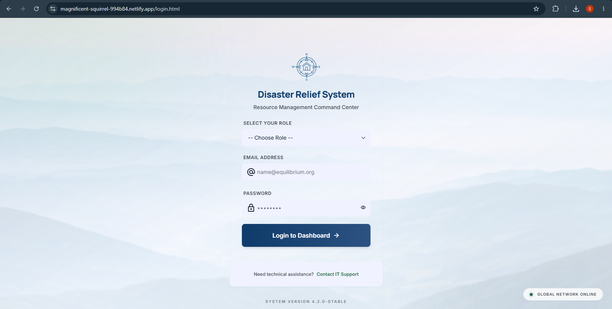
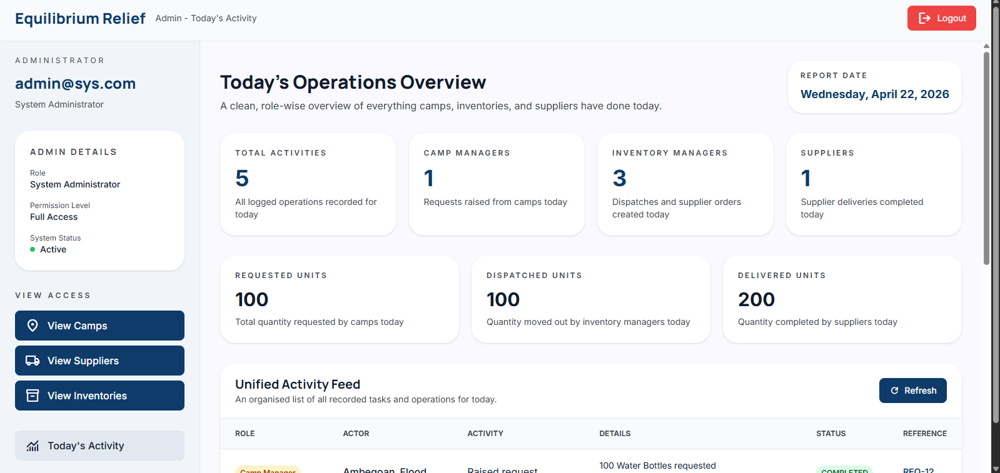
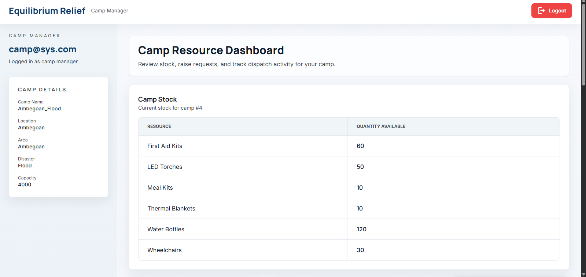
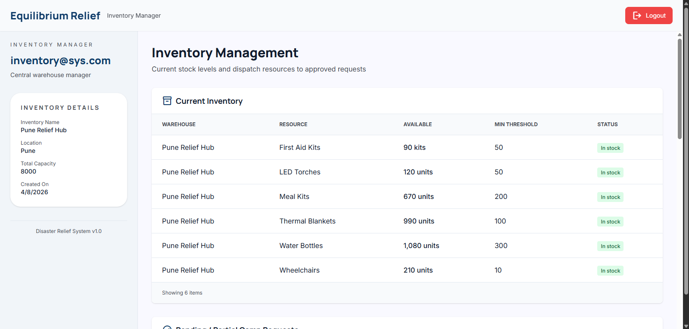
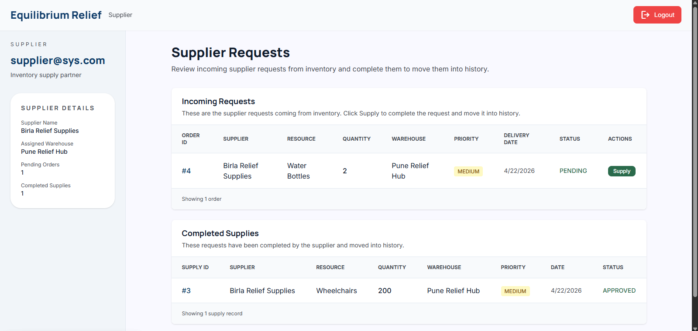

# Disaster Relief Resource Management System

A full-stack, role-based Disaster Relief Management System developed to streamline disaster response operations through centralized data management, resource tracking, relief camp administration, supplier coordination, and inventory monitoring.

Built as part of a **Database Management Systems (DBMS)** course, this project demonstrates the practical application of relational database design, normalization, SQL operations, cloud database deployment, and role-based workflow management.

---

## Academic Focus

This project showcases the implementation of core DBMS concepts, including:

* Relational Database Design
* Entity Relationship Modeling (ERD)
* Database Normalization (up to 3NF)
* Primary & Foreign Key Constraints
* Referential Integrity
* SQL Queries and Joins
* Inventory Management Systems
* Transaction-Based Operations
* Cloud Database Deployment

---

## Live Deployment

### Frontend

https://magnificent-squirrel-994b84.netlify.app/login.html

### Database

Aiven Cloud MySQL Database

### Monitoring

UptimeRobot

---

# Problem Statement

During natural disasters, relief operations often suffer from fragmented information systems, delayed communication, inventory mismanagement, and inefficient resource allocation.

Relief agencies require a centralized platform to:

* Manage disaster information
* Track affected areas
* Coordinate relief camps
* Monitor inventory levels
* Process resource requests
* Manage suppliers and incoming aid
* Maintain accurate operational records

The Disaster Relief Management System addresses these challenges through a structured relational database and a role-based management platform.

---

# Project Objectives

* Centralize disaster management data
* Improve resource allocation efficiency
* Reduce data redundancy
* Enable real-time inventory tracking
* Manage relief camps effectively
* Support informed decision-making during emergencies
* Maintain accurate records of resource distribution

---

# Key Features

## Disaster Management

* Register disaster-related information
* Maintain affected area records
* Track relief operations centrally

## Relief Camp Management

* Manage camp details and capacity
* Monitor camp inventory
* Raise resource requests

## Inventory Management

* Maintain centralized inventory records
* Track stock levels
* Dispatch resources to camps

## Supplier Management

* Process supplier requests
* Track deliveries
* Replenish inventory stocks

## Administrative Monitoring

* View system-wide activity
* Monitor requests, dispatches, and deliveries
* Access operational dashboards

## Authentication & Access Control

* Role-based access management
* Controlled operational views

---

# User Roles

The system follows a role-based operational model.

| Role              | Responsibilities                                                     |
| ----------------- | -------------------------------------------------------------------- |
| Admin             | Monitor operations, dashboards, requests, dispatches, and deliveries |
| Camp Manager      | Manage camp inventory, raise resource requests, track fulfillment    |
| Inventory Manager | Manage inventory stock, fulfill requests, create supplier orders     |
| Supplier          | Approve supply requests, complete deliveries, track supply history   |

---

# Disaster Relief Workflow

The application models a real-world disaster relief supply chain:

1. Relief camps raise resource requests.
2. Inventory managers review pending requests.
3. Available stock is dispatched to camps.
4. Supplier orders are generated when inventory requires replenishment.
5. Suppliers fulfill orders and replenish inventory.
6. Administrators monitor all activities through centralized dashboards.

---

# System Architecture

```text
User
   │
   ▼
Frontend (HTML, CSS, JavaScript)
   │
   ▼
Node.js + Express Backend
   │
   ▼
MySQL Database (Aiven)
```

### Deployment Architecture

```text
Netlify
   │
   ▼
Node.js + Express Backend
   │
   ▼
Aiven Cloud MySQL Database
```

---

# Database Highlights

The database consists of multiple interconnected entities representing disaster relief operations.

### Major Entities

| Entity              | Description                      |
| ------------------- | -------------------------------- |
| Disaster            | Stores disaster information      |
| Affected Area       | Stores impacted regions          |
| Relief Camp         | Camp management records          |
| Resource            | Resource catalog                 |
| Central Inventory   | Central warehouse stock          |
| Camp Stock          | Resource stock at camps          |
| Resource Request    | Requests raised by camps         |
| Request Fulfillment | Distribution tracking            |
| Supplier            | Supplier information             |
| Supply              | Incoming supplies                |
| User                | Authentication and authorization |

---

# DBMS Concepts Implemented

## Entity Relationship Modeling

Designed a relational schema representing:

* Disaster
* Affected Area
* Relief Camp
* Resource
* Inventory
* Supplier
* User

## Normalization

Database normalized to reduce:

* Data redundancy
* Update anomalies
* Insertion anomalies
* Deletion anomalies

## Relationships

### One-to-Many

* One Disaster → Many Affected Areas
* One Relief Camp → Many Resource Requests

### Many-to-Many

Implemented using transactional and linking tables.

Examples:

* Camps ↔ Resources
* Suppliers ↔ Resources

## Constraints

* Primary Keys
* Foreign Keys
* Unique Constraints
* ENUM Constraints

## SQL Operations

* SELECT
* INSERT
* UPDATE
* DELETE
* JOIN
* GROUP BY
* Aggregate Functions
* Nested Queries

## Data Integrity

Maintained using:

* Referential Integrity
* Foreign Key Constraints
* Controlled Data Validation

---

# Entity Relationship Diagram

[](Output\er-diagram.png)

---

# Database Documentation

The complete database schema, table definitions, constraints, and implementation details are documented in:

**Final_DisasterDatabase.md**

---

# Repository Structure

```text
Disaster_Management_DBMS_Mini
│
├── Backend
│   ├── server.js
│   ├── seedUsers.js
│   ├── package.json
│   ├── package-lock.json
│   └── .env
│
├── Frontend
│   ├── admin.html
│   ├── camp_manager.html
│   ├── inventory_manager.html
│   ├── login.html
│   ├── resource_management.html
│   ├── supplier.html
│   └── index.html
│
├── Final_DisasterDatabase.md
├── README.md
```

---

# Technology Stack

## Frontend

* HTML5
* Tailwind CSS
* JavaScript

## Backend

* Node.js
* Express.js

## Database

* MySQL

## Cloud Services

* Aiven Database Hosting
* Netlify Frontend Hosting
* Render Backend Hosting
* UptimeRobot Monitoring

## Development Tools

* Visual Studio Code
* Git
* GitHub

---

# Related Output Images

## Login Page

[](Output/login.png)

## Admin Dashboard

[](Output/admin.png)

## Camp Manager Dashboard

[](Output/camp.png)

## Inventory Manager Dashboard

[](Output/inventory.png)

## Supplier Dashboard

[](Output/supplier.png)

---

# Local Setup

## Clone Repository

```bash
git clone https://github.com/swarali-marwadi/Disaster_Management_DBMS_Mini.git
cd Disaster_Management_DBMS_Mini
```

## Backend Setup

```bash
cd Backend
npm install
npm start
```

## Frontend

Open:

```text
Frontend/login.html
```

in your browser.

---

# Sample SQL Queries

### Total Population Affected by Each Disaster

```sql
SELECT d.disaster_name,
SUM(a.population_affected) AS total_population
FROM disaster d
JOIN affected_area a
ON d.disaster_id = a.disaster_id
GROUP BY d.disaster_name;
```

### Resources Available in Each Camp

```sql
SELECT rc.camp_name,
r.resource_name,
cs.quantity_available
FROM camp_stock cs
JOIN relief_camp rc
ON rc.camp_id = cs.camp_id
JOIN resource r
ON r.resource_id = cs.resource_id;
```

### Pending Resource Requests

```sql
SELECT *
FROM resource_request
WHERE status = 'Pending';
```

---

# Current Status

Implemented Features:

* Role-based dashboards
* Camp request management
* Inventory dispatch workflow
* Supplier order processing
* Admin monitoring dashboard
* Cloud-hosted MySQL database integration
* Read-only operational views for administrators
* Resource fulfillment tracking
* Stock visibility and inventory management

---

# Challenges Faced

* Designing a normalized relational schema
* Maintaining referential integrity
* Modeling real-world relief workflows
* Integrating frontend, backend, and cloud database services
* Managing multi-role system behavior

---

# Future Enhancements

* Stronger authentication and authorization
* Environment-based configuration management
* One-click SQL database setup scripts
* Automated API testing
* Enhanced validation and error handling
* Production-ready deployment configuration
* Volunteer management module
* Real-time notification system
* GIS-based disaster mapping
* Mobile application support

---

# Tools and Resources Used

* Draw.io — ER Diagram Design
* Visual Studio Code — Development Environment
* GitHub — Version Control & Collaboration
* Stitch — Initial UI Inspiration and Layout Prototyping
* ChatGPT, Codex, VS Code Agent, and Claude — Used as AI-assisted development tools for debugging, code optimization, interface refinement, and feature enhancements.

---

# Academic Information

**Course:** Database Management Systems (DBMS)

**Project Type:** Semester Mini Project

**Academic Year:** 2025–26

---

# License

This project was developed for educational and academic purposes as part of a Database Management Systems course.

---

⭐ If you found this project useful, consider giving it a star.
